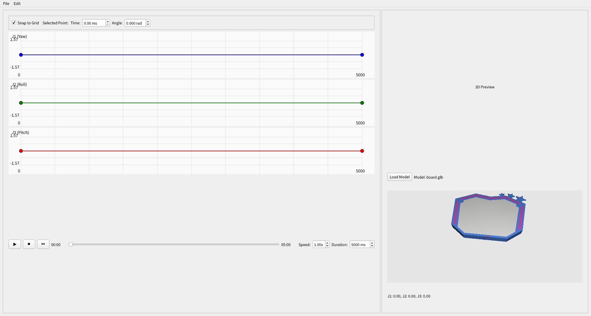

# RinaChoreo - 3軸ロボットモーション作成ツール

このツールはClaude codeによって作成されたものです。

3軸ロボットの関節角度軌道を直感的に作成・編集できるGUIツールです。グラフベースのモーション編集機能、3Dプレビュー、タイムライン再生機能を提供します。



## 特徴

- **グラフベースのモーション編集**: 各軸（J1-Yaw, J2-Roll, J3-Pitch）ごとに分離されたグラフでの直感的な編集
- **3Dプレビュー**: GLTF/GLBモデルを使用したリアルタイム3D可視化
- **タイムライン再生**: 可変速度での再生コントロール（0.1x - 3.0x）
- **CSV出力**: 20ms間隔でのサンプリングデータ出力
- **プロジェクト管理**: YAML/JSON形式での保存・読み込み

## システム要件

- **OS**: Ubuntu 22.04 (推奨)
- **Python**: 3.8以上
- **依存関係**: requirements.txtを参照

## インストール

```bash
# リポジトリをクローン
git clone <repository-url>
cd rinachoreo

# 依存関係をインストール
pip install -r requirements.txt
```

## 使用方法

### アプリケーションの起動

```bash
# メインスクリプトから起動
python main.py

# モジュールとして起動
python -m src.main_window
```

### 基本操作

#### グラフ編集
- **ドラッグ**: 制御点の移動
- **ダブルクリック**: 制御点の追加
- **右クリック**: 制御点の削除
- **Snaptoグリッド**: 時間グリッドへの吸着機能

#### キーボードショートカット
- `Ctrl+Z` / `Ctrl+Y`: 元に戻す/やり直し
- `Ctrl+S`: プロジェクト保存
- `Delete`: 選択点削除
- `Space`: 再生/停止

#### 3Dプレビュー
- マウスで視点回転・ズーム
- 対応形式: `.gltf`, `.glb`
- リアルタイム姿勢表示

## 仕様

### ロボット仕様
- **対象軸**: J1 (Yaw), J2 (Roll), J3 (Pitch)
- **角度範囲**: config.yamlで軸ごとに設定可能
- **デフォルト**: 各軸 ±90° (-π/2 to +π/2)

### 色分け
- **J1 (Yaw)**: 青
- **J2 (Roll)**: 緑  
- **J3 (Pitch)**: 赤

### 出力形式
```csv
time(ms), J1(rad), J2(rad), J3(rad)
0, 0.0, 0.0, 0.0
20, 0.01, 0.02, -0.01
40, 0.02, 0.04, -0.02
```

### 補間方法
- Catmull-Rom スプライン補間（通過型）

### 角度制限の設定
config.yamlファイルを編集して軸ごとに角度制限を設定できます：

```yaml
# rinachoreo Configuration File
angle_limits:
  j1_yaw:
    min: -3.14  # -180度
    max: 3.14   # +180度
  j2_roll:
    min: -1.57  # -90度
    max: 1.57   # +90度
  j3_pitch:
    min: -0.785 # -45度
    max: 0.785  # +45度
```

## プロジェクト構造

```
rinachoreo/
├── main.py                 # アプリケーションエントリーポイント
├── requirements.txt        # Python依存関係
├── board.glb              # サンプル3Dモデル
├── app_image.png          # UIレイアウト参考画像
└── src/
    ├── __init__.py
    ├── main_window.py      # メインウィンドウとアプリケーション調整
    ├── graph_editor.py     # グラフベースモーション編集
    ├── preview_3d.py       # OpenGL 3D可視化
    ├── timeline_controls.py # 再生コントロール
    └── project_manager.py  # CSV出力とプロジェクトファイル管理
```

## 将来の拡張予定

- ZeroMQを使用したモーションデータストリーミング送信機能

## 開発者向け情報

### アーキテクチャ
- **Motion Editor** (`graph_editor.py`): スプライン補間によるグラフベースインターフェース
- **3D Renderer** (`preview_3d.py`): GLTF/GLBサポート付きOpenGL可視化
- **Timeline System** (`timeline_controls.py`): 可変速度再生コントロール
- **Export System** (`project_manager.py`): CSV生成とYAML/JSONプロジェクトファイル
- **Main Window** (`main_window.py`): アプリケーション調整とUIレイアウト

### 技術スタック
- **GUI Framework**: PyQt6
- **3D Graphics**: PyOpenGL
- **数値計算**: NumPy, SciPy
- **3Dモデル**: pygltflib
- **設定ファイル**: PyYAML

## ライセンス

このプロジェクトのライセンス情報については、LICENSEファイルを参照してください。